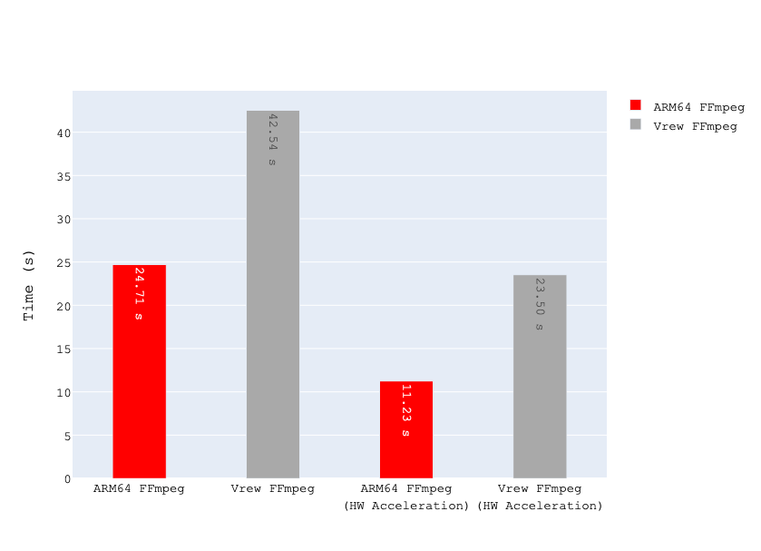

<p align="center">
    
</p>

<span align="center">

# vroom

</span>

<p align="center">
    
    
</p>

### What is vroom?
* The video editing software [Vrew](https://vrew.voyagerx.com/en/) uses x86_64 architecture FFmpeg even on Apple Silicon. It's not optimized for Apple Silicon, so it's slow.
* vroom is a script that patches the FFmpeg used by Vrew to the native FFmpeg for Apple Silicon. It replaces the original FFmpeg with the native FFmpeg for Apple Silicon.
* For the detailed information, please visit [my medium post](https://medium.com/@bayernmuller/vrew-웹-기반-영상-편집-앱-분석-그리고-더-빠르게-만들기-5a7805588c74) (Korean).

### Benchmark
<p align="center">
    <br/>
    lower is better.
</p>

* comparison of the performance of the vrew and patched FFmpeg on Apple M2 chip.
* vroom makes the video editing process about 2 times faster.

### Before installation
- **Not officially supported** by Vrew. Use at your own risk.
- Only for Apple Silicon Macs.
- Requires Homebrew and ARM64 FFmpeg. If you don't have it, vroom will ask you to install it.
- vroom is not responsible for any damage caused by using the patch.

### Installation

* Run the following command in your terminal.
```bash
curl -s https://raw.githubusercontent.com/BayernMuller/vroom/main/vroom.sh | bash
```

* vroom will check the required packages and ask you to install them if you don't have them.

```bash
[2024-02-14 15:38:39] Checking environment
[2024-02-14 15:38:39] SUCCESS: It's Apple Silicon
[2024-02-14 15:38:39] SUCCESS: Homebrew is installed
[2024-02-14 15:38:39] SUCCESS: FFmpeg is installed
[2024-02-14 15:38:39] SUCCESS: Vrew is installed
[2024-02-14 15:38:39] - Which do you want to do? (install/uninstall): install
[2024-02-14 15:38:41] - Do you want to continue? (y/n): y
[2024-02-14 15:38:43] Installing patch
[2024-02-14 15:38:43] SUCCESS: Installed patch
```

* If you want to uninstall the patch, write `uninstall` instead of `install` when selecting the action.